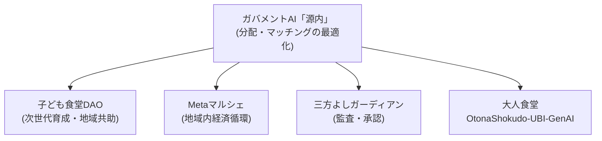

# OtonaShokudo-UBI-GenAI

> [!NOTE]
> **開発状況 (Development Status)**
>
> 本リポジトリでは、基礎自治体レベルで実装・検証可能なオンチェーン型ユニバーサル・ベーシックインカム（大人食堂UBI）モデルの設計・実証・公開を進めています。
>
> World IDを活用した本人確認（Sybil耐性）、Metaマルシェ連携、スマートコントラクトなど、大人食堂の基盤となったコアロジックは、先行リポジトリ [`kodomo-shokudo-dao-gennai`](https://github.com/SunVerdir/kodomo-shokudo-dao-gennai) にて公開・稼働中です。

---

## 概要 (Overview)

AI普及に伴う雇用構造の変化、人口減少による地域経済の縮小、過度な東京一極集中、そして大規模自然災害（南海トラフ地震・首都直下地震等）といった複合的リスクに対する予防的レジリエンスとして、基礎自治体レベルで低コスト・低リスクに導入・検証可能な「オンチェーン大人食堂（ユニバーサル・ベーシックインカム）」の実装モデルを提示します。

既存の「子ども食堂DAO」（先行リポジトリ `kodomo-shokudo-dao-gennai`）で構築した地域内相互扶助モデルを基盤に、大掛かりな国家制度転換に先立って、まず地域単位での実証を積み上げるボトムアップ型のアプローチを採ります。

## エコシステム全体像 (Ecosystem)

本構想は、これまで構築してきた地域共助・技術基盤を土台として位置づけています。

## 主な特徴 (Key Features)

- **ボトムアップ型給付インフラ**: 子ども食堂DAOおよびMetaマルシェの実績（岡山県でのフィールド設計）を活用した、地域経済循環への自然な拡張。
- **低コスト＆高透明性記帳**: スマートコントラクトによる、法定通貨ペッグ型の透明かつ低運用コストな給付・トラッキング基盤。
- **本人確認とプライバシーへの配慮**: World ID等（分散型ID/DID）を活用した不正受給・重複給付の防止。生体データの取り扱いについては別途プライバシー影響評価（PIA）を行う方針。
- **検証可能な運用記録**: 三方よしガーディアンで実装済みのハッシュチェーン・承認ゲートの仕組みを応用し、スローガンではなく実装で運用の健全性を担保する。
- **オンチェーン寄付**: 国内外の支援者が仲介手数料を抑えてオンチェーンで直接寄付できる仕組みを将来的に検討。
- **AI駆動開発**: 既存アセット（子ども食堂DAO・岡山県実証モデル）を活用した、生成AIによる迅速な開発。

## 政策的な位置づけ (Policy Context)

2026年に法制化された防災庁（11月発足予定）は、南海トラフ地震・首都直下地震等への一元的な対応を担う組織です。本構想は、中央機能の混迷時や有事の際にも自律稼働しうる分散型給付基盤として、将来的にデジタル庁が主導するデジタル基盤や防災庁の緊急支援ラインとの連携を見据えた設計を行っています。（※現時点において特定の行政機関と直接的な提携関係を示すものではなく、オープンソース・アプローチによる技術・政策提言として位置づけています。）

生成AI技術の進展速度に社会制度の整備が追いついていないという指摘は、国内外の議論でもなされています（例: Anthropic社CEOダリオ・アモデイ氏は2026年9月、AI業界の開発速度を抑制し第三者による評価の仕組みを整える必要性を指摘）。本構想がガバメントAI「源内」等の生成AIコンポーネントを活用するにあたっても、こうしたAIガバナンス・安全性への目配りを前提とした、検証可能な形での段階的な社会実装を志向します。

## プロジェクト状況とロードマップ (Status & Roadmap)

**Current Status（現在地）**: 基礎概念の定義、および本リポジトリでの機能拡張・シミュレーションの検証フェーズ。

| フェーズ | 時期 | 内容 |
|---|---|---|
| Phase 1 | 〜2026年10月 | 本リポジトリにて開発・PoC公開を進めつつ、直近のコンテスト・ハッカソン（Agentic AI Hackathon、GENIAC-PRIZE等）へ応募 |
| Phase 2 | 2026年11月〜 | Zenodoへのワーキングペーパー（プレプリント）公開に伴い、シミュレーション機能等の拡充を継続 |
| Phase 3 | 2027年〜 | 基礎自治体モデルでの実証データをもとに、政策パッケージとしての独立運用・提言活動を開始 |

## デモの動かし方 (Try the Demo)

本プロトタイプは2通りの方法で動かせます。

- **ブラウザで直接開く（`index.html` / stlite版）**: Pythonのインストールが不要で、`index.html` をダブルクリックしてブラウザで開くだけで動作します。ブラウザ上でPython実行環境を読み込む仕組みのため、初回表示までに数秒〜十数秒かかります。エラーではなく必要な読み込み時間なので、プレゼンや関係者へのデモで見せる際は、開始直前ではなく数分前に一度開いて読み込みを済ませておくとスムーズです。
- **ローカルで実行する（`app.py`）**: `pip install streamlit pandas numpy` の後、`streamlit run app.py` を実行すると `http://localhost:8501` でアプリが起動します。

「3. 仮想大人食堂 (GenAI対話)」の会話履歴は、他のメニューに切り替えてから戻ってきても保持される仕様です（意図的な挙動）。

## 関連リンク (Related Resources)

- **先行リポジトリ（子ども食堂DAO基盤）**: [SunVerdir/kodomo-shokudo-dao-gennai](https://github.com/SunVerdir/kodomo-shokudo-dao-gennai) — World ID本人確認・Metaマルシェ連携・スマートコントラクト等のコアロジックを公開
- **論文・研究資料 (Zenodo)**: Preprints / Working Paper（準備中）
- **構想公式Webサイト**: [SunVerdir Basic Income Concept](https://www.sunverdir.com/Basic-Income)
- **著者**: 菅野敦也 / Atsunari Sugano（[Wikidata](https://www.wikidata.org/wiki/Q100455577)）

---

*Developed by Atsunari Sugano / SunVerdir*
